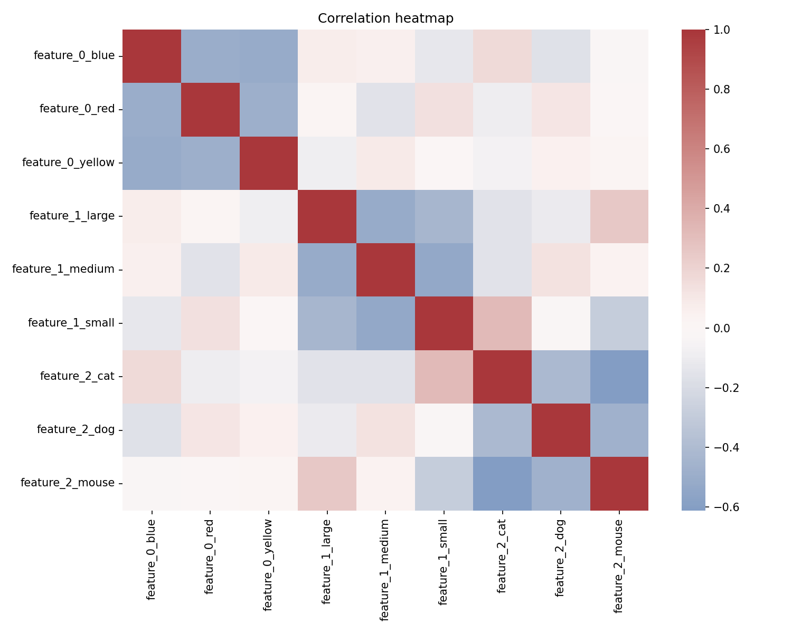

# Categorical analysis report
Generated: 2025-10-23T13:51:18.276660+00:00 UTC

## 1. Distributions summary
- **feature_0**: unique=3, top=blue (35.00%)
- **feature_1**: unique=3, top=medium (39.00%)
- **feature_2**: unique=3, top=mouse (41.00%)

## 2. Correlation matrix
- correlation matrix shape: (9, 9)
- CSV: `correlation.csv`

## 3. Mutual information (categorical pairs)
- CSV: `mutual_info.csv`

## 4. Conclusions
- Max positive correlation 0.32 between feature_1_small and feature_2_cat.
- Max negative correlation -0.61 between feature_2_cat and feature_2_mouse.
- Average absolute pairwise correlation is 0.21, some dependencies exist.
- Most skewed category: feature_2, top value share = 41.00%.
- Top mutual information 0.073 between feature_1 and feature_2.
- Consider dimensionality reduction or feature selection if many one-hot columns.
